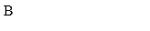

## documentation
the documentation is available in the :


[](https://github.com/pouximixi0/framework/blob/a1ae38b19560cc4f766bfb343ed2e66b74cd2692/README.md#documentation-en-francais)
[]()

### documentation en francais
ce framework est en devlopement pour l'instant il n'y a pas beaucoups de fonction. il va contenire des fonction utile.

1. comment utiliser le framework ?
pour ce fair vous avec juste a integrer le lien dans une balise scritps : 
```javascript
<script src="https://cdn.jsdelivr.net/gh/pouximixi0/framework@361cd0341c02b4d0a66ef453a91c566d7e6edf47/function.js"></script>
```


2. la premiere fonction est `typingSimulation(text, delay, element)`, cette fonction va servir a faire une animation du text d'une personne entrain d'ecrire, et tous ca en une seul ligne !!!.

* exemple :
```html 
<!DOCTYPE html>
<html lang="en">
  <head>
    <meta charset="UTF-8" />
    <meta name="viewport" content="width=device-width, initial-scale=1.0" />
    <script src="https://cdn.jsdelivr.net/gh/pouximixi0/framework@361cd0341c02b4d0a66ef453a91c566d7e6edf47/function.js"></script>
    <title>Document</title>
  </head>
  <body>
    <p id="typing"></p>

    <script>
      typingSimulation("Bonjour ceci est un text", 70, "typing");
    </script>
  </body>
</html>

```


* comment l'utiliser ? <br>
pour l'utiliser c'est tres simple `typingSimulation(text, delay, element)` <br>
dans text il suffit de mettre le __<u>text</u>__ que l'on ve afficher <br>
ensuite dans delay c'est la vitesse d'affichage  <br>
