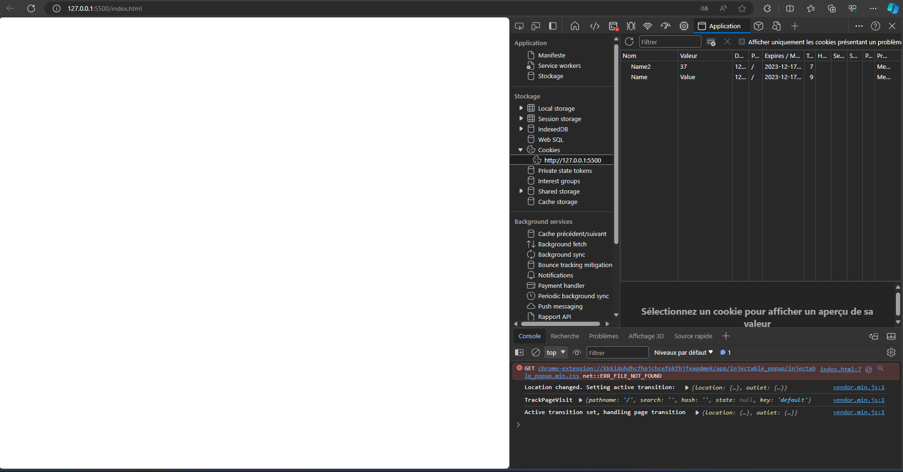

## documentation
the documentation is available in the :


[](https://github.com/pouximixi0/framework/blob/a1ae38b19560cc4f766bfb343ed2e66b74cd2692/README.md#documentation-en-francais)
[]()

### documentation en francais
ce framework est en devlopement pour l'instant il n'y a pas beaucoups de fonction. il va contenire des fonction utile.

1. comment utiliser le framework ?
pour ce fair vous avec juste a integrer le lien dans une balise scritps : 
```javascript
<script src="https://cdn.jsdelivr.net/gh/pouximixi0/framework@361cd0341c02b4d0a66ef453a91c566d7e6edf47/function.js"></script>
```
<br>
<br>
2. le fonction :

#### typingSimulation
la premiere fonction est `typingSimulation(text, delay, element)`, cette fonction va servir a faire une animation du text d'une personne entrain d'ecrire, et tous ca en une seul ligne !!!.

* exemple :
```html 
<!DOCTYPE html>
<html lang="en">
  <head>
    <meta charset="UTF-8" />
    <meta name="viewport" content="width=device-width, initial-scale=1.0" />
    <script src="https://cdn.jsdelivr.net/gh/pouximixi0/framework@361cd0341c02b4d0a66ef453a91c566d7e6edf47/function.js"></script>
    <title>Document</title>
  </head>
  <body>
    <p id="typing"></p>

    <script>
      typingSimulation("Bonjour ceci est un text", 70, "typing");
    </script>
  </body>
</html>

```

<br>
comment l'utiliser ? <br>
pour l'utiliser c'est tres simple typingSimulation(text, delay, element) <br>
text : le text que l'on veux afficher.<br>
delay : la vitesse d'affichage exemple : 1 tres rapide et 100 tres lent.<br>
element : l'élément avec un id que l'on veux écrire dans mon cas typing?
<br>
<br>

#### createCookie
ensuite nous avous un pack de fonction pour la gestion de cookies. en premier la fonction pour le créer est createCookie(nom, contenue, jours), cette fonction va servir a creer un cookie. cela peux etre tres utilie a certain utilisation par exemple pour un gestion d'utilisateur connecter par un compte sur un machine.

info : les cookie sont accessible en allant dans ctrl + shift + i --> application dans les icone en haut --> Cookie --> adresse du site (!!! il faux etre sur une ip pour utiliser les cookies vous pouvais creer un serveur local sur votre machine en utilisant sur visual studio code cette [extention](https://marketplace.visualstudio.com/items?itemName=ritwickdey.LiveServer) )

* exemple :
```html
<!DOCTYPE html>
<html lang="en">
  <head>
    <meta charset="UTF-8" />
    <meta name="viewport" content="width=device-width, initial-scale=1.0" />
    <script src="https://cdn.jsdelivr.net/gh/pouximixi0/framework@361cd0341c02b4d0a66ef453a91c566d7e6edf47/function.js"></script>
    <title>Document</title>
  </head>
  <body>
    <script>
      createCookie("Name", "Value", 50);
      createCookie("Name2", 37, 50);
    </script>
  </body>
</html>
```

<br>
*__comment l'utiliser ?__* <br>
nom : il s'agit du nom du cookies.<br>
contenue : il s'agit de la valeur qu'on lui attribue elle peut etre (string, int, bool, float)<br>
jours : cette valeur en jours av definir combien de jours le cookies doit rester a la fin il va se suprimer<br>
